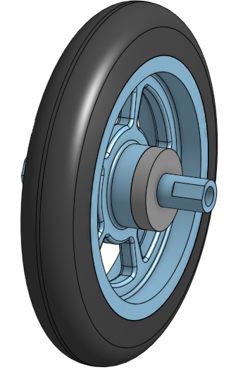
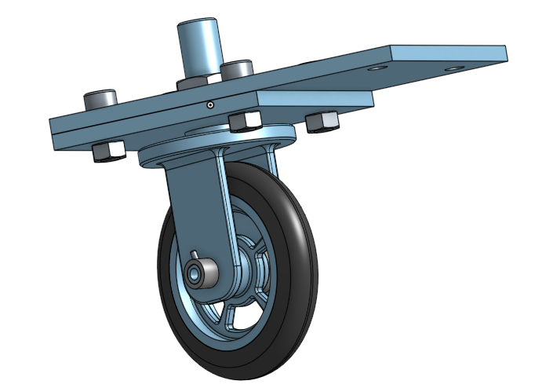
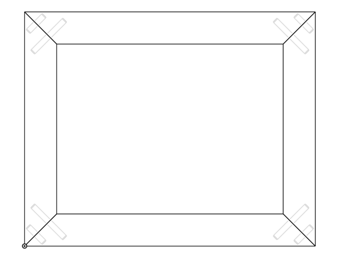
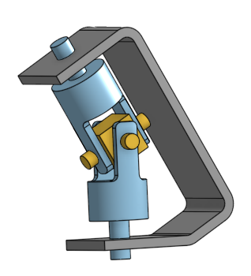

## Base

### Description 
  In this assignment the task was to create the base of a caster using Onshape.

### Lessons Learned 
  This assignment was an introduction into the CAD program Onshape. I learned the basic information about how to sketch, extrude, dimension, and linear pattern. I was able to figure it out its very similar to SolidWorks just that the toolbar is slightly different and also that its in the cloud so you dont have to worry about manually saving. 

### Images and Links

Link to Onshape Document: https://cvilleschools.onshape.com/documents/db947e86732b2acb3fc0f047/w/a5d84f12b520ae19909d2aca/e/0d0766e2ce91ec9ff1f14abc

## Mount

### Description 
  This assignment you create a mount used to connect the base to the wheel system using Onshape.

### Lessons Learned 
  This assignment was similar to the first one where you use simple sketching, extruding, and linear patterns. One new thing I did learn is how to use variables on Onshape, You can set dimensions as variables by using # and then the variables name.

### Images and Links

Link to Onshape Document: https://cvilleschools.onshape.com/documents/db947e86732b2acb3fc0f047/w/a5d84f12b520ae19909d2aca/e/0d0766e2ce91ec9ff1f14abc

## Fork

### Description 
  In this assignment the task was to create the part that the base and mount holds and its the piece that contains the wheel.

### Lessons Learned 
  In this lesson I learned how to fillet and chamfer in Onshape. I discovered that in fillets and Chamfers you can have tangent propagation and this automatically selects any connecting lines and makes fillets and chamfers even easier.  

### Images and Links

Link to Onshape Document: https://cvilleschools.onshape.com/documents/db947e86732b2acb3fc0f047/w/a5d84f12b520ae19909d2aca/e/0d0766e2ce91ec9ff1f14abc

## Tire

### Description 
  In this assignment you create the wheel for the caster assembly.

### Lessons Learned 
  I learend how to revolve in Onshape which like everything else is very similar to Solid Works. I used some new relations like symetric. Also, I learend that just like in Solid Works when you bring a dimension past the center line it becomes a Diameter instead of a radius. 

### Images and Links

Link to Onshape Document: https://cvilleschools.onshape.com/documents/db947e86732b2acb3fc0f047/w/a5d84f12b520ae19909d2aca/e/0d0766e2ce91ec9ff1f14abc

## Wheel

### Description 
  In this assignment you creating the wheel/rim of the caster asssembly.

### Lessons Learned 
   I learned in this assignment how to control the display of the part like if its shaded or shaded with hidden edges and those functions. Also, this was my first time using circular patternin Onshape so I got some experience with that and how it works. Also, I learned that unlike Solid Works you dont need one connected feature you can use multiple features at once.

### Images and Links

Link to Onshape Document: https://cvilleschools.onshape.com/documents/db947e86732b2acb3fc0f047/w/a5d84f12b520ae19909d2aca/e/0d0766e2ce91ec9ff1f14abc

## Axle, Collar, Bearing, and Washer

### Description 
  In this assignment you make a series of small simple parts used to hold the caster together.

### Lessons Learned 
  I learned how to make an extrude go in both directions using symetric in Onshape. I also learned a really helpful feauture called "use" where you can take edges and elements of other sketches and involve them in the sketch your currently editting. Another thing I learned is using the merge scope to only extrude cut through one part.

### Images and Links
  

Link to Onshape Document: https://cvilleschools.onshape.com/documents/db947e86732b2acb3fc0f047/w/a5d84f12b520ae19909d2aca/e/0d0766e2ce91ec9ff1f14abc

## Wheel and Axle Sub-Assembly

### Description 
  In this assignment you create an Assembly of jsut the wheel, axle, and bearings.

### Lessons Learned 
  In this assignment, I learned how to use to different mates which where Fastened and revolute. Unlike Solid Works, in Onshape you use mate connecters instead of edges and faces. Also, this was my introductions to Assemblies and i learned how to input parts, and I learned a little about how Onshape works with versions.

### Images and Links

Link to Onshape Document: https://cvilleschools.onshape.com/documents/db947e86732b2acb3fc0f047/w/a5d84f12b520ae19909d2aca/e/0d0766e2ce91ec9ff1f14abc

## Caster Final Assembly

### Description 
  In this assignment you take all the oarts you've created to create the final Assembly with all pieces mated together.

### Lessons Learned 
  In this lesson I learned how to input standard content which contains all the screws and nuts. I learned parallel mates and a feautre of mates called offset which can be used to alter your mate by a factor of milimeters in either the x, y, or z direction. 

### Images and Links

Link to Onshape Document: https://cvilleschools.onshape.com/documents/db947e86732b2acb3fc0f047/w/a5d84f12b520ae19909d2aca/e/0d0766e2ce91ec9ff1f14abc

## Dowel Pins

### Description 
  In this assignment the task was to use onshapes configuration to change the diameter, length, and chamfer of dowel pins and use them to make a picture frame.

### Lessons Learned 
  I learned how to use configurations by using the configuration panel on the right side of the screen. You create a new configuration list rename it to whatever you are configuring and then enter the names of the configurations. Then you use the configure feature to select the feature that you are configuring in your sketch and you put in the different values you want. Then it should appear at the top of your design tree and you should be able to change between the differen configurations there.

### Images and Links

Link to Onshape Document: https://cvilleschools.onshape.com/documents/2d474181bb37fefdc8cd8bed/w/9924aed1a578e543be369826/e/d012a31edf8a42cdb25e7ff5

## Onshape Challenge

### Description 
  In this assignment your task is to create three parts, cube, spinner, and bracket, to make an assembly. 

### Lessons Learned 
  I used a surface extrude for the first time which involves lines instead of shapes. I also used cylindrical mates which are very similar to revolute but they allow more movement. I also learned to always double check your sketches, because I struggled with the assembly because one of my holes on my bracket was 20 mm from the outer edge and not the center so my mates would mess up.

### Images and Links

Link to Onshape Document: https://cvilleschools.onshape.com/documents/d1db11fc1387b5ce4549b9dc/w/f0b43b9d363273a7dff8a4d6/e/d7cc1fd7e20b583a8894b9a3

## 

### Description 
  

### Lessons Learned 
  

### Images and Links

Link to Onshape Document: 

## 

### Description 
  

### Lessons Learned 
  

### Images and Links

Link to Onshape Document: 

## 

### Description 
  

### Lessons Learned 
  

### Images and Links

Link to Onshape Document: 

